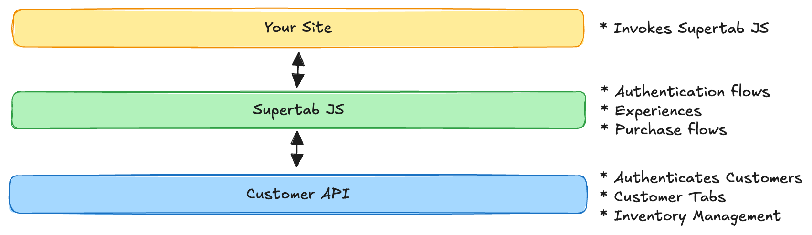

import SdkWarning from '/snippets/sdk-warning.mdx';

The Customer API powers [Supertab Experiences](/supertab-experiences/introduction) and can be used
to develop integrations with Supertab for websites or products that run primarily in your
customer's browser.

## Supertab JS

It is best to utilise the Customer API through [Supertab JS](/dead).
The underlying API is documented here as reference for what is happening "under the hood".
All examples include their Supertab JS equivalents.

<SdkWarning />

## Features

* Identify your customer and receive information on the purchases on their tab
* Retrieve details of the inventory you've made available for sale
* Check your customer's existing entitlements
* Make purchases on your customer's behalf

## Workflow

<Steps>
    <Step title="Prepare">
        Load information on the current [user and available inventory](./clients) to discover available offerings,
        your customer's tab limit and currency preferences.

        We automatically create [API clients](./authentication) for you for each of your sites.
    </Step>
    <Step title="Check for pre-existing entitlements">
        Check if your customer already has access from a prior purchase or current subscription.
    </Step>
    <Step title="Display offerings to your customer">
        Offer your customer a choice of ways to purchase access to your content, product or digital goods.
    </Step>
    <Step title="Make a purchase">
        When your customer has made a choice, place the [purchase on their tab](./purchasing) or begin a subscription.
    </Step>
    <Step title="Forward your customer to the payment flow">
        Supertab requires payment once the customer fills their tab.
        Purchase results will tell you when to redirect your customer into the [payment flow](./payment).
    </Step>
    <Step title="Check status of customer purchases">
        Use the [Merchant API](/dead) or subscribe to a [webhook](/dead) to get secure updates
        about your customer's purchases and entitlement status.
    </Step>
</Steps>

## Next

<CardGroup cols={2}>
    <Card title="Authentication" icon="lock" href="./authentication">
        Authenticate customers to take actions on their behalf
    </Card>
    <Card title="Versioning" icon="calendar-days" href="./versioning">
        Call the correct version of the API
    </Card>
    <Card title="Config" icon="gear" href="./clients">
        Discover available offerings and customer preferences
    </Card>
    <Card title="Purchasing" icon="dollar-sign" href="./purchasing">
        Make purchases
    </Card>
</CardGroup>

