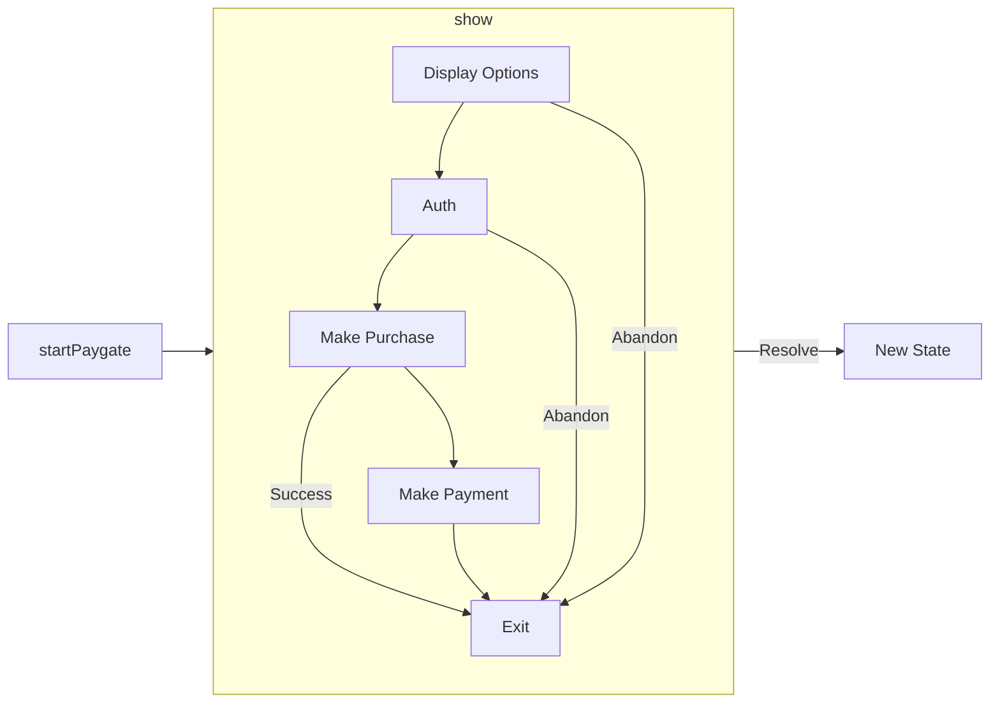

Supertab.js makes it simple to embed powerful monetization flows into your site.
This guide will walk you through launching experiences and what information you
receive about choices your customers make when interacting with a Supertab experience.

#### Before You Begin

Make sure that you have:

- [Created an experience](/supertab-experiences/experiences) in the Business Portal
- [Installed Supertab.js](/supertab-js/installation) via npm or CDN.

## Initialize the Supertab.js Client

First, create a new `Supertab` instance using your client ID.

<CodeGroup>
    ```javascript Installed via npm
    const supertabClient = new Supertab({clientId: "client.your_client"});
    ```

    ```javascript Installed via CDN
    const supertabClient = new window.Supertab({clientId: "client.your_client"});
    ```
</CodeGroup>

Replace `client.your_client` with the live or test client ID associated with site you created
when setting up your experiences. Supertab.js uses this client ID to make sure its running
in the correct place.

## Display a Paygate

The Paygate is a customizable experience that handles login, entitlement checks and purchase flows for you.
You can launch it any time: on page load, after a user action or in response to app logic.

```javascript Quickstart

// First create the paygate, replace `experience.your_experience` with your experience ID
// Supertab.js will fetch the configuration for the paygate for you.
// No paygate is shown at this point, you must call .show()
const supertabPaygate = await supertabClient.createPaygate({
    experienceId: "experience.your_experience"
});

// Display the paygate to your user
await supertabPaygate.show()
```

#### Options for `createPaygate`

Offerings available for sale, messaging text and styling are controlled from the Business Portal


| Key            | Type     | Required | Description                                                 |
|:---------------|:---------|:---------|:------------------------------------------------------------|
| `experienceId` | `string` | Yes      | ID of the Paygate experience created in the Business Portal |


#### Returns

`createPaygate` returns an object containing the initial state of the Paygate
and methods for showing it to users.

| Field          | Type                                    | Description                                                                                                                                     |
|:---------------|:----------------------------------------|:------------------------------------------------------------------------------------------------------------------------------------------------|
| `initialState` | `ExperienceStateSummary`                | The state of the paygate immediately after config is loaded, can be used to check if the user is logged in or has a priort entitlement already. |
| `logIn`        | `() => Promise<ExperienceStateSummary>` | Launch an auth flow immediately, if necessary. The returned promise resolves when the login flow is completed.                                  |
| `show`         | `() => Promise<ExperienceStateSummary>` | Display the paygate to the user, the returned promise resolves when the paygate closes.                                                         |
| `destroy`      | `() => void`                            | Clean up and remove all Supertab elements from the DOM.                                                                                         |

### Paygate Lifecycle

The state of the Paygate is generally returned to you as a promise which resolves when the Paygate exits.
The Paygate may exit as a result of a successful purchase or as a result of user abandonment.



Supertab Experiences follows an async programming paradigm.
Each interaction with the paygate object will return a promise which resolves once the user has finished interacting with the Paygate.

You can handle these promises through the use of `async` / `await` or through promise chaining with `.then()`.

<CodeGroup>
    ```javascript async / await
    async function showPaygate() {
        const paygate = await supertabClient.createPaygate({ experienceId: "experience.your_experience" });

        const state = await paygate.show();

        // You can now work with the state
    }
    ```

    ```javascript Promise chaining with .then()
    function showPaygate() {
        supertabClient.createPaygate({
            experienceId: "experience.abc",
        }).then((paygate) => {
            paygate.show()
                .then((state) => {
                    // You can now work with the state
                })
        });
    }
    ```
</CodeGroup>

Examples on this page use `async` / `await`.

### Check For Prior Entitlement (Optional)

You may wish to check for any prior entitlement your user has purchased without immediately showing the paygate.
This is achieved by inspecting the initial state of the paygate immediately after creating it.

```javascript Prior Entitlements
const supertabPaygate = await supertabClient.createPaygate({
    experienceId: "experience.your_experience"
});

state = supertabPaygate.initialState;

authStatus = state.authStatus;

// If we do not have an authenticated user, attempt to log them in.
// This will refresh the user's authentication silently if we hold a refresh token for them.
// Otherwise, the user will see a Supertab SSO popup in their browser.
if (authStatus !== "valid") {
    state = await supertabPaygate.logIn();
    if (state.authStatus !== "valid") {
        // The logIn promise may resolve on the user abandoning the authentication process.
        // In this case the user has chosen not to login with Supertab (i.e they have closed the SSO popup).
        return false
    }
}

priorEntitlement = state.priorEntitlement

// We can now find out if the user has a prior entitlement
hasPriorEntitlement = priorEntitlement[0].hasEntitlement
return hasPriorEntitlement
```

This is only necessary if you want to force a user log in before continuing.

### Show the Paygate

In general, we don't need to manually check for prior entitlement because the Paygate will immediately exit
upon detecting a prior entitlement if it already has an authenticated user.

For most cases it's appropriate to immediately show the Paygate:

```javascript Showing the Paygate
const supertabPaygate = await supertabClient.createPaygate({
    experienceId: "experience.your_experience"
});

// The Paygate will launch and return to you its updated state when it exits.
// The Paygate may exit as a result of a purchase, or may be closed by the user.
// The state tells you what the user chose to do.
state = await supertabPaygate.show();
```

Once the promise returned from `show()` resolves you can inspect the updated state of the Paygate to determine
what choices you user made.

```typescript Experience state
type ExperienceStateSummary = {
    purchase: Purchase | null;
    priorEntitlement: EntitlementStatus[] | null;
    authStatus: AuthStatus;
    purchasedOffering: Offering | null;
    tab: Tab | null
    paymentCompleted: boolean;
}
```

### Checking for purchases

The experience state will tell you if your user made a purchase from the paygate.
If a purchase was made `purchase` will be present. If a user made a payment to complete their purchase, `paymentResult` will be `true`.

| `OfferingSummary` | Type | Description |
|:---|:---|:---|
|`id`| `string`| ID of the purchase. You can use this with the Merchant API for backend checks the purchase is valid. |
|`offeringId`|`string`| ID of the offering which was purchased. |
|`description`|`string`| Description of the offering which was purchased|
|`status`|`string`| Possible values: `completed`, `pending`.<br /><br />A purchase may be created as `pending` when the user is required to make payment. If handling entitlements yourself, only grant access when a purchase is `completed`. <br /><br />The paygate will automatically launch the payment flow when necessary. |

```javascript Check for a purchase

// Show the Paygate and wait for the promise to resolve.
// The promise resolves once the paygate has exited and is no longer showing to the user.
const state = await supertabPaygate.show();

if (!state.purchase) {
    // No purchase was made
    return
}

if (state.purchase.status === 'completed') {
    // A purchase has been made successfully!
    console.log("Customer made a purchase!", state.purchasedOffering.offeringId)
}

if (state.paymentResult) {
    // The user made a payment in order to complete their purchase
    console.log("Customer made a payment!")
}
```

## Wrapping Up

We've covered:

- How to create and show a paygate
- The lifecycle of the paygate and its async programming model
- How to work with the state of the paygate to check for purchases and entitlements
