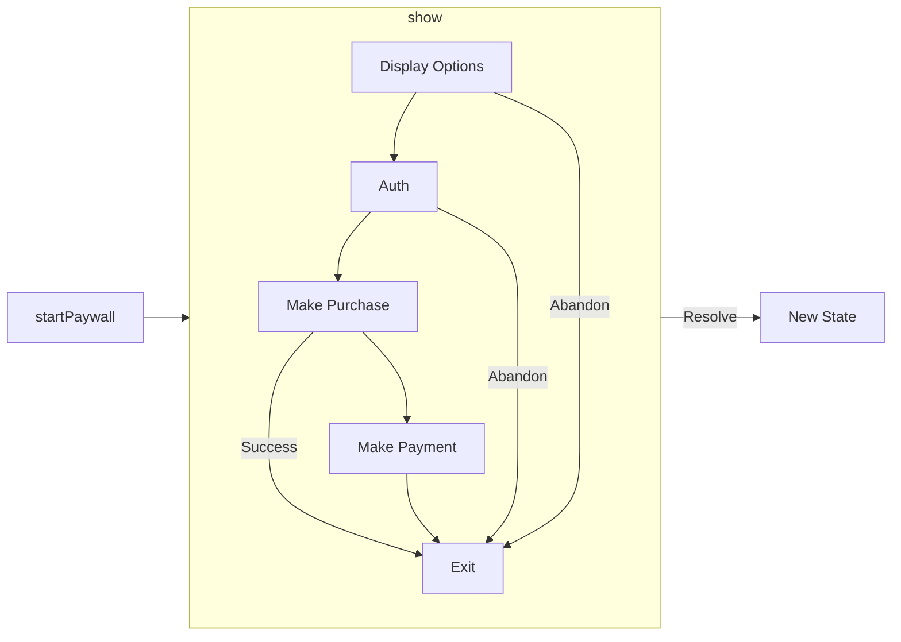

import ExperienceStateSummaryTypes from "/snippets/supertab-js/experience-state-summary-types.mdx";

Supertab.js makes it simple to embed powerful monetization flows into your site.
This guide will walk you through launching experiences and what information you
receive about choices your customers make when interacting with a Supertab experience.

#### Before You Begin

Make sure that you have:

- [Created an experience](/supertab-experiences/experiences) in the Business Portal
- [Installed Supertab.js](/supertab-js/installation) via npm or CDN.

## Initialize the Supertab.js Client

First, create a new `Supertab` instance using your client ID.

```javascript
const supertabClient = new Supertab({clientId: "client.your_client"});
```

Replace `client.your_client` with the live or test client ID associated with site you created
when setting up your experiences. Supertab.js uses this client ID to make sure its running
in the correct place.

## Display a Paywall

The Paywall is a customizable experience that handles login, entitlement checks and purchase flows for you.
You can launch it any time: on page load, after a user action or in response to app logic.

```javascript Quickstart

// First create the paywall, replace `experience.your_experience` with your experience ID
// Supertab.js will fetch the configuration for the paywall for you.
// No paywall is shown at this point, you must call .show()
const supertabPaywall = await supertabClient.createPaywall({
    experienceId: "experience.your_experience"
});

// Display the paywall to your user
await supertabPaywall.show()
```

#### Options for `createPaywall`

Offerings available for sale, messaging text and styling are controlled from the Business Portal


| Key                | Type     | Required | Description                                                         |
|:-------------------|:---------|:---------|:--------------------------------------------------------------------|
| `experienceId`     | `string` | Yes      | ID of the Paywall experience created in the Business Portal         |
| `purchaseMetadata` | `object` | No       | Key-value pairs of custom information associated with the purchase. |


#### Returns

`createPaywall` returns an object containing the initial state of the Paywall
and methods for showing it to users.

| Field          | Type                                    | Description                                                                                                                                     |
|:---------------|:----------------------------------------|:------------------------------------------------------------------------------------------------------------------------------------------------|
| `initialState` | `ExperienceStateSummary`                | The state of the paywall immediately after config is loaded, can be used to check if the user is logged in or has a priort entitlement already. |
| `logIn`        | `() => Promise<ExperienceStateSummary>` | Launch an auth flow immediately, if necessary. The returned promise resolves when the login flow is completed.                                  |
| `show`         | `() => Promise<ExperienceStateSummary>` | Display the paywall to the user, the returned promise resolves when the paywall closes.                                                         |
| `destroy`      | `() => void`                            | Clean up and remove all Supertab elements from the DOM.                                                                                         |

### Paywall Lifecycle

The state of the Paywall is generally returned to you as a promise which resolves when the Paywall exits.
The Paywall may exit as a result of a successful purchase or as a result of user abandonment.



Supertab Experiences follows an async programming paradigm.
Each interaction with the paywall object will return a promise which resolves once the user has finished interacting with the Paywall.

You can handle these promises through the user of `async` / `await` for through callbacks (`.then()`).

<CodeGroup>
    ```javascript async / await
    async function showPaywall() {
        const paywall = await supertabClient.createPaywall({ experienceId: "experience.your_experience" });

        const state = await paywall.show();

        // You can now work with the state
    }
    ```

    ```javascript callback
    function showPaywall(callback) {
        supertabClient.createPaywall({
            experienceId: "experience.abc",
        }).then((paywall) => {
            paywall.show()
                .then((state) => {
                    // You can now work with the state
                })
        });
    }
    ```
</CodeGroup>

Examples on this page use `async` / `await`.

### Check For Prior Entitlement (Optional)

You may wish to check for any prior entitlement your user has purchased without immediately showing the paywall.
This is achieved by inspecting the initial state of the paywall immediately after creating it.

```javascript Prior Entitlements
const supertabPaywall = await supertabClient.createPaywall({
    experienceId: "experience.your_experience"
});

state = supertabPaywall.initialState;

authStatus = state.authStatus;

// If we do not have an authenticated user, attempt to log them in.
// This will refresh the user's authentication silently if we hold a refresh token for them.
// Otherwise, the user will see a Supertab SSO popup in their browser.
if (authStatus !== "valid") {
    state = await supertabPaywall.logIn();
    if (state.authStatus !== "valid") {
        // The logIn promise may resolve on the user abandoning the authentication process.
        // In this case the user has chosen not to login with Supertab (i.e they have closed the SSO popup).
        return false
    }
}

priorEntitlement = state.priorEntitlement

// We can now find out if the user has a prior entitlement
hasPriorEntitlement = priorEntitlement.hasEntitlement
return hasPriorEntitlement
```

This is only necessary if you want to force a user log in before continuing.

### Show the Paywall

In general, we don't need to manually check for prior entitlement because the Paywall will immediately exit
upon detecting a prior entitlement if it already has an authenticated user.

For most cases it's appropriate to immediately show the Paywall:

```javascript Showing the Paywall
const supertabPaywall = await supertabClient.createPaywall({
    experienceId: "experience.your_experience"
});

// The Paywall will launch and return to you its updated state when it exits.
// The Paywall may exit as a result of a purchase, or may be closed by the user.
// The state tells you what the user chose to do.
state = await supertabPaywall.show();
```

Once the promise returned from `show()` resolves you can inspect the updated state of the Paywall to determine
what choices you user made.

### Checking for purchases

The experience state will tell you if your user made a purchase from the paywall.
If a purchase was made `purchasedOffering` will be present and `purchaseCompleted` will be `true`.

| `OfferingSummary` | Type | Description |
|:---|:---|:---|
|`id`| `string`| ID of the purchase. You can use this with the Merchant API for backend checks the purchase is valid. |
|`offeringId`|`string`| ID of the offering which was purchased. |
|`description`|`string`| Description of the offering which was purchased|
|`status`|`string`| Possible values: `completed`, `pending`.<br /><br />A purchase may be created as `pending` when the user is required to make payment. If handling entitlements yourself, only grant access when a purchase is `completed`. <br /><br />The paywall will automatically launch the payment flow when necessary. |

```javascript Check for a purchase

// Show the Paywall and wait for the promise to resolve.
// The promise resolves once the paywall has exited and is no longer showing to the user.
state = await supertabPaywall.show();

if (!state.purchasedOffering) {
    // No purchase was made
    return
}

if (state.purchasedOffering.status === 'completed') {
    // A purchase has been made successfully!
    console.log("Customer made a purchase!", state.purchasedOffering.offeringId)
}

if (state.purchasedOffering.paymentResult) {
    // The user made a payment in order to complete their purchase
    console.log("Customer made a payment!")
}
```

## Wrapping Up

We've covered:

- How to create and show a paywall
- The lifecycle of the paywall and its async programming model
- How to work with the state of the paywall to check for purchases and entitlements
