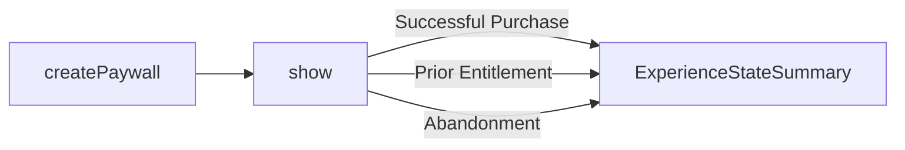

Supertab.js makes it simple to embed powerful monetization flows into your site.
This guide will walk you through launching experiences and what information you
receive about choices your customers make when interacting with a Supertab experience.

#### Before You Begin

Make sure that you have:

- [Created an experience](/supertab-experiences/experiences) in the Business Portal
- [Installed Supertab.js](/supertab-js/installation) via npm or CDN.

## Initialize the Supertab.js Client

First, create a new `Supertab` instance using your client ID.

```javascript
const supertabClient = new Supertab({clientId: "client.your_client"});
```

Replace `client.your_client` with the live or test client ID associated with site you created
when setting up your experiences. Supertab.js uses this client ID to make sure its running
in the correct place.

## Display a Paywall

The Paywall is a customizable experience that handles login, entitlement checks and purchase flows for you.
You can launch it any time: on page load, after a user action or in response to app logic.

```javascript Quickstart

// First create the paywall
// Replace `experience.your_experience` with your experience ID
// Supertab.js will fetch the configuration of the paywall for you.
// No paywall is shown at this point, you must call .show()
const supertabPaywall = await supertabClient.createPaywall({
    experienceId: "experience.your_experience"
});

// Display the paywall to your user
// The paywall closes after a succesful purchase or on user abandonment
await supertabPaywall.show()
```

#### Options for `createPaywall`

Offerings available for sale, messaging text and styling are controlled from the Business Portal


| Key                | Type     | Required | Description                                                         |
|:-------------------|:---------|:---------|:--------------------------------------------------------------------|
| `experienceId`     | `string` | Yes      | ID of the Paywall experience created in the Business Portal         |
| `purchaseMetadata` | `object` | No       | Key-value pairs of custom information associated with the purchase. |


#### PaywallExperienceResult

`createPaywall` returns a `PaywallExperienceResult` object containing the initial state of the Paywall
and methods for showing it to users.

| Field          | Type                                    | Description                                                                                                                                     |
|:---------------|:----------------------------------------|:------------------------------------------------------------------------------------------------------------------------------------------------|
| `initialState` | `ExperienceStateSummary`                | The state of the paywall immediately after config is loaded, can be used to check if the user is logged in or has a prior entitlement already. |
| `logIn`        | `() => Promise<ExperienceStateSummary>` | Launch an auth flow immediately, if necessary. The returned promise resolves when the login flow is completed.                                  |
| `show`         | `() => Promise<ExperienceStateSummary>` | Display the paywall to the user, the returned promise resolves when the paywall closes.                                                         |
| `destroy`      | `() => void`                            | Clean up and remove all Supertab elements from the DOM.                                                                                         |

## Paywall Lifecycle

The state of the Paywall is generally returned to you as a promise which resolves when the Paywall exits.
The Paywall may exit as a result of a successful purchase or as a result of user abandonment.



Supertab Experiences uses an async programming paradigm.
Each interaction returns a promise which resolves once the user has finished interacting with the Paywall.

You can handle these promises through the use of `async` / `await` or through promise chaining with `.then()`.

<CodeGroup>
    ```javascript async / await
    async function showPaywall() {
        const paywall = await supertabClient.createPaywall({ experienceId: "experience.your_experience" });

        const state = await paywall.show();

        // You can now work with the state
    }
    ```

    ```javascript Promise chaining with .then()
    function showPaywall() {
        supertabClient.createPaywall({
            experienceId: "experience.abc",
        }).then((paywall) => {
            paywall.show()
                .then((state) => {
                    // You can now work with the state
                })
        });
    }
    ```
</CodeGroup>

Examples on this page use `async` / `await`.

## Checking for Purchases

The experience state will tell you if your user made a purchase from the paywall.

| `ExperienceStateSummary` | Type     | Description                                                                                                                                                                                                               |
|:-------------------------|:---------|:--------------------------------------------------------------------------------------------------------------------------------------------------------------------------------------------------------------------------|
| `purchase`               | `Purchase \| null` | The purchase made by the user.                                                                                                                                                                          |
| `paymentResult`          | `boolean` | `true` if the user made a payment to complete their purchase.                                                                                                                                                             |

You can find detail about any purchase the user made by inspecting the `purchase` field.

| `Purchase`    | Type     | Description                                                                                                                                                                                                                                                                                                   |
|:--------------|:---------|:--------------------------------------------------------------------------------------------------------------------------------------------------------------------------------------------------------------------------------------------------------------------------------------------------------------|
| `id`          | `string` | ID of the purchase. You can use this with the Merchant API for backend checks the purchase is valid.                                                                                                                                                                                                          |
| `offeringId`  | `string` | ID of the offering which was purchased.                                                                                                                                                                                                                                                                       |
| `description` | `string` | Description of the offering which was purchased                                                                                                                                                                                                                                                               |
| `status`      | `string` | Possible values: `completed`, `pending`.<br /><br />A purchase may be created as `pending` when the user is required to make payment. If handling entitlements yourself, only grant access when a purchase is `completed`. <br /><br />The paywall will automatically launch the payment flow when necessary. |

```javascript Check for a purchase

// Show the Paywall and wait for the promise to resolve.
// The promise resolves once the paywall has exited and is no longer showing to the user.
const state = await supertabPaywall.show();

if (!state.purchase) {
    // No purchase was made
    return
}

if (state.purchase.status === 'completed') {
    // A purchase has been made successfully!
    console.log("Customer made a purchase!", state.purchasedOffering.offeringId)
}

if (state.paymentResult) {
    // The user made a payment in order to complete their purchase
    console.log("Customer made a payment!")
}
```

### Check For Prior Entitlement (Optional)

You may wish to check for any prior entitlement your user has purchased without immediately showing the paywall.
This is achieved by inspecting the initial state of the paywall immediately after creating it.

| `ExperienceStateSummary` | Type                 | Description                                             |
|:-------------------------|:---------------------|:--------------------------------------------------------|
| `priorEntitlement`       | `EntitlementStatus[] \| null` | Array of any prior entitlements the user has purchased. |

`EntitlementStatus` contains information on which `contentKey`s the user has an entitlement for
and when their entitlement expires.

| `EntitlementStatus` | Type      | Description                                                        |
|:--------------------|:----------|:-------------------------------------------------------------------|
| `contentKey`        | `string`  | ID of the content key which the user has an entitlement for.       |
| `expires`           | `string`  | Date when the user's entitlement expires. e.g `2025-01-01 00:00:00` |
| `hasEntitlement`    | `boolean` | `true` if the user has an entitlement for the content key.         |

```javascript Prior Entitlements
const supertabPaywall = await supertabClient.createPaywall({
    experienceId: "experience.your_experience"
});

const state = supertabPaywall.initialState;
const entitlements = state.priorEntitlement;

// contentKey we wish to check entitlement for
const checkFor = "site.your_site_id";

for (const entitlement of entitlements) {
    if (entitlement.contentKey === checkFor && entitlement.hasEntitlement) {
        // The user has an entitlement
        return true
    }
}

// The user does not have an entitlement
return false;
```

You may also check for entitlements after the paywall has exited by inspecting the `priorEntitlement` field of
the resolves `ExperienceStateSummary` object.

### Force LogIn (Optional)

It is only possible to check for prior entitlements without starting the paywall experience when the user is
already logged in.

You can force an immediate login by calling `logIn` on the paywall itself.

```javascript Force Login
const supertabPaywall = await supertabClient.createPaywall({
    experienceId: "experience.your_experience"
});

// Supertab SSO will open in a popup and return to you the new paywall state
// WARNING: You should only open a popup in response to user action to avoid the browser blocking the popup.
const state = await supertabPaywall.logIn()
```

Because `.logIn()` immediately opens a popup it should only be called in response to a user action.

## Wrapping Up

We've covered:

- How to create and show a paywall
- The lifecycle of the paywall and its async programming model
- How to work with the state of the paywall to check for purchases and entitlements
