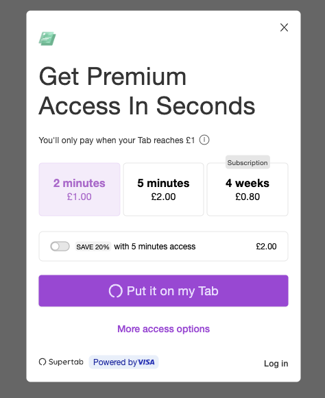

As of 5th February 2025 you can now use the all new Supertab Paygate to secure and monetize your content or access
to your SaaS product. The Paygate replaces the existing On Page Widget and offers enhanced options for controlling
how you price and sell your content.

<Frame caption="Supertab Paygate in action">
    
</Frame>

Supertab supports selling access to your content for prices as low as 1¢, on a one-off or subscription basis.
Customers make purchases against a running tab which they settle after reaching a predefined limit.

The Paygate offers several key enhancements over the previous On Page Widget:

- Increased flexibility in the type and number of offerings sold.
  You are no longer restricted to selling exactly three offerings.
- Sell one-off timepasses or subscriptions side by side, improving your revenue pipeline and conversion from occassional to regular customers
- Link offerings together as upsells to make clear to customers which offerings are the best value for money.
- Customizable styling to match your identity.

Paygates are the first major component to Supertab Experiences, providing you with a variety of ways to monetize
your content in a way that works for your business.

### Getting Started

Create a Paygate Experience from the [Business Portal](https://business.supertab.co) and follow the onscreen instructions.

**Existing customers** can use the same offerings they're already selling through the On Page Widget.
Your existing deployments will continue to function as expected until you have migrated.
[Contact Support](https://support.supertab.co/hc/en-us/requests/new) for migration assistance, if required.

Follow the onscreen installation instructions to get the Paygate running on your site.
Simply deploy the provided code on any page you wish to monetize.

<Frame>
    
</Frame>

For more details consult the relevant [Experiences documentation](/supertab-experiences/experiences).

### Contact Sales

The Supertab Paygate is available now, [contact sales](https://supertab.co) to learn more.

