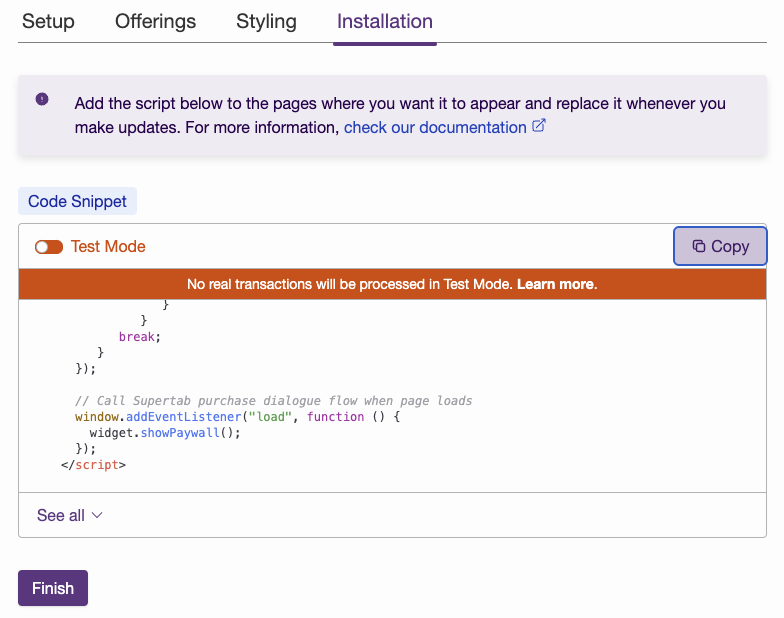

We’re thrilled to announce major updates to the Supertab Experiences, including a completely redesigned Basic Paygate and changes to the Purchase Button.

<Frame caption="Supertab Paygate in action">
  
</Frame>

### What's New?

- **Unlimited Offerings**:
  You can now create as many time passes and subscriptions as you need —
  subscriptions can now stand alone or be combined with other offerings.
- **Flexible Basic Paygate**:
  - A new two-screen layout for a cleaner, more engaging experience.
  - Design customization, including logo support, for better brand alignment.
- **More Flexibility**: Create **multiple paygate** for different part of your website and
  control where each one appears using specific installation codes.

### Why Switch?

We’re deprecating the older versions of both the Basic Paygate and the Purchase Button soon.
Your current scripts will continue to work for now, but we highly recommend switching to the new versions
to unlock the latest features and maintain compatibility.

#### Upgrading an existing Paygate

1. Go the **Experiences** section of the [Business Portal](https://business.supertab.co) and edit your Paygate
2. Once you make changes, you'll see an updated preview and receive a new installation code.
3. Replace the old code on your website with the new **Live Mode** installation script.

#### Create a brand new Paygate

1. Remove all instances of the old Paygate script from your website.
2. Go to the **Experiences** section and follow the steps to set up your new Paygate
3. Copy the **Live Mode** installation script and add it to your website.

#### Upgrading an existing Purchase Button

1. Go the **Experiences** section of the [Business Portal](https://business.supertab.co) and edit your Purchase Button
2. Review the configuration, **saving at each step**
3. Copy the **Live Mode** installation script and replace the old snippet on all pages where the button is used.

<Info>
  **Important**: Use the Live Mode snippet to process real transactions.
  In Test Mode, the Paygate will display a test indicator and users will not be charged.
</Info>

##### Add a Logo to your Paygate

1. Go to the **Websites** section of the [Business Portal](https://business.superab.co) and edit your website.
2. Upload your logo. It will automatically appear in the Paygate preview and in all Basic Paygate Experiences.
3. If you are using the old Paygate you will need to upgrade in order to see your logo displayed.

### Need Help?

Our team is here to assist you every step of the way.
If you have any questions or need [support](https://support.supertab.co/hc/en-us/requests/new), don’t hesitate to reach out.

We’re excited to see how these updates help you grow your business and enhance your experience with Supertab\!

<Frame>
  
</Frame>

For more details consult the relevant [Experiences documentation](/supertab-experiences/experiences).

### Contact Sales

The Supertab Basic Paygate is available now, [contact sales](https://supertab.co) to learn more.